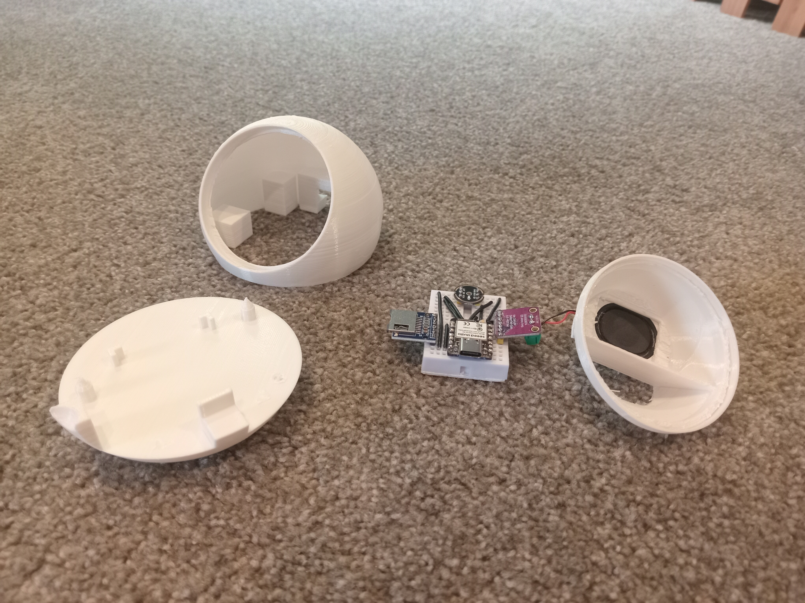
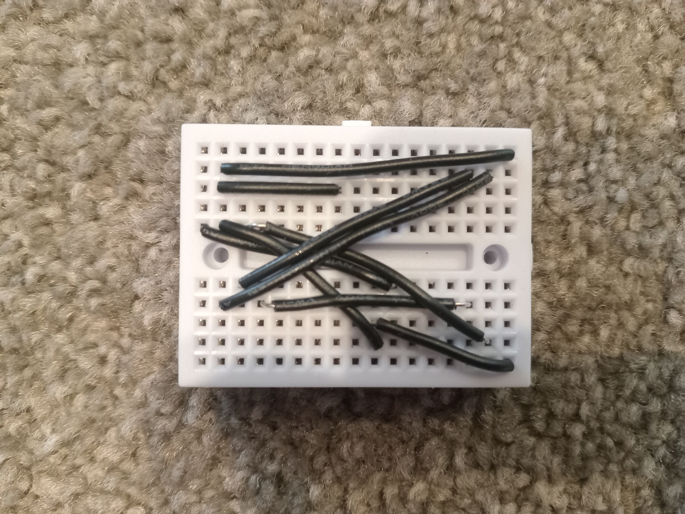
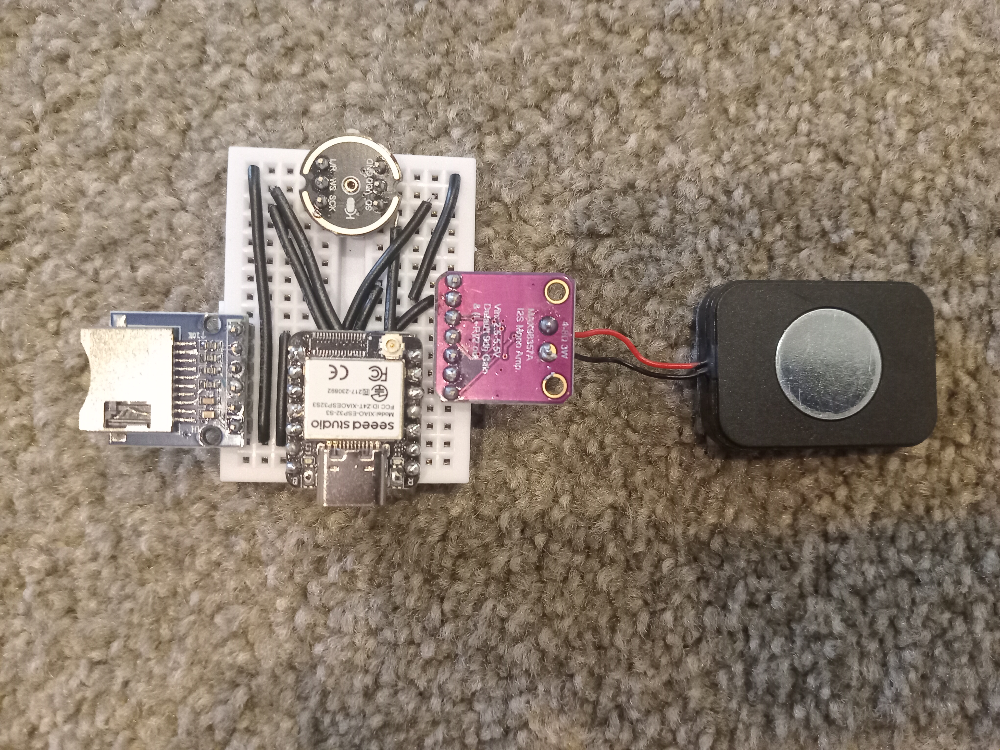

# Olzu-Ellipse

My project for an awesome voice controlled music player! 

---

Welcome.

TL;DR, over the past few months, I have been developing this project, intending to sell it somewhere, but isn't good enough to sell, so here it is open source.

# How to make:

### Parts list:

| Part | Where to buy | Cost (USD) |
|---|---|---:|
| XIAO ESP32S3 | Seeed studios | $11 |
| INMP441 microphone | Aliexpress | $1 |
| MAX98357A amplifyer | Aliexpress | $1 |
| SD card module | Aliexpress | $2 |
| Mini breadboard SBY-170 | Aliexpress | $1 |
| 8 Ohm speaker 3525/2535 slot | Aliexpress | $2 |
| 22AWG PVC wire | Aliexpress | $2 |

First thing, get ESP-IDF V5.2.7, as that is what works with the ESP-IDF ADE and Speech recog. I used the VS code exntention. Next, download and open the project in PlatformIO. 

Next, wire up the bread board like this:

```
// INMP441 microphone -- I2S0, RX 
#define MIC_WS_IO     GPIO_NUM_2    // D1
#define MIC_SCK_IO    GPIO_NUM_3    // D2
#define MIC_SD_IO     GPIO_NUM_4    // D3
 
// MAX98357A amplifier -- I2S1, TX (separate I2S peripheral from the mic)
#define SPK_BCLK_IO   GPIO_NUM_6    // D5
#define SPK_WS_IO     GPIO_NUM_5    // D4
#define SPK_DOUT_IO   GPIO_NUM_43   // D6 (UART0 console disabled)
 
// MicroSD card -- SPI bus
#define SD_SCK_IO     GPIO_NUM_7    // D8
#define SD_MISO_IO    GPIO_NUM_44   // D7 (UART0 console disabled)
#define SD_MOSI_IO    GPIO_NUM_8    // D9
#define SD_CS_IO      GPIO_NUM_9    // D10
```
Just wires:



With components:



Then, 3DP the parts. Draw seams on the indents of the male and female base and shell prongs.

Assemble, upload code, then put your songs on in the form of MP4 or WAV (WAV may sometimes skip songs) with 1.mp3, 2.wav, 3.mp3, etc with that order of titles dictating play order. Then, ask "Ellipse," then play, stop, next, back, volume up, or volume down. It should act like this:

[Video](https://drive.google.com/file/d/1HiCZSoKqFnZCQKwasglbz2WqJZx6tAWT)


